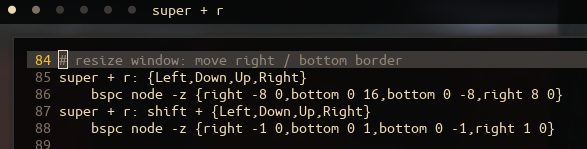

# polybar-sxhkd



- Read `sxhkd` status fifo and display the label of hotkey chain

## Require

- `node` (tested on v10.13.0 "Dubinum" LTS)

## Usage

- Download [the script](https://raw.githubusercontent.com/piutranq/polybar-sxhkd/master/polybar-sxhkd.js) and put it in path you want.
- Edit the configuration section in the script for your customization.
- Make the fifo to write sxhkd status (eg. `$ mkfifo $HOME/.cache/sxhkd.fifo`)
- Run sxhkd with the status fifo. (eg. `$ sxhkd -s $HOME/.cache/sxhkd.fifo &`)
- Add this module in your polybar config, and reload polybar.

```ini
[module/sxhkd]
type = custom/script
tail = true
label = %output%
exec = /path/of/the/script.js
```

## Configuration section

- Configuration is stored directly in the script, as nodejs object.

### pipe

- The full path of sxhkd status pipe.
- eg. `const pipe = require('os').homedir() + '/.cache/sxhkd.fifo'`

### label

- When you have started hotkey chain, the script will display the label.

#### label.prefix, label.suffix

- Prefix and suffix of the label. it is useful for formatting the label.

#### label.list

- Assigned label list for each hotkey, as the `key: value` format.

##### key
- `H` + the prefix of hotkey chain to display, including all whitespace.
- single prefix example:
    - `'Hsuper + m'` can be used for `super + m;` in sxhkdrc
- chained prefix example:
    - `'Hsuper + m; n; o'` for `super + m; n; o;`
- branched prefixes example: 
    - `'Hsuper + m; n; o'` can be used also, when `super + {m,M}; {n,N}; {o,O};` is written in sxhkdrc.
- all whitespaces are not trimmed, including the last whitespaces.
    - When the hotkey is written as `super + m ;` in sxhkdrc, `'super + m'` cannot be recognized.
    - Because, there is one whitespace between `m` and `;` in sxhkdrc. key in label.list should be `'super + m '`

##### value
- The label for the hotkey. it will be displayed actually.

## Script section

- The actual script is written in this. if you are familiar with nodejs, you can edit it yourself.
- The script creates readline interface and set the input to the sxhkd fifo.
- The readline interface reads each line from the fifo, and run main function for the line.

## License
- This script is under the MIT license.

